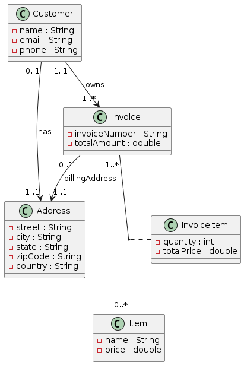

# Projet : Digital Invoicing

## Description

Application web "Digital Invoicing" : API REST Spring Boot pour gérer les factures, clients et paiements, avec persistance JPA.

Interface React moderne pour créer, visualiser et exporter (PDF) des factures, avec recherche, filtres.

## Fonctionnalités
### Fonctionnalités principales :

- Gestion CRUD complète pour clients, factures et adresses.
- Listes paginées avec recherche et filtres (priorité sur les factures).
- Génération et impression/export PDF des factures.
- Validation côté serveur et client, gestion d'erreurs standardisée.
- Documentation API (Swagger).

## Architecture

Diagramme de classes (généré depuis `resources/diagrams/class_diagram.puml`):



## Structure
Arborescence minimale du projet :

```
digital-invoicing/
├── docs/                      
├── spring-boot/                      
│   ├── src/main/java/...
│   ├── src/main/resources/
│   │   └── application.yml
│   └── pom.xml
├── react-app/                    
│   ├── src/
│   ├── public/
│   └── package.json
├── resources/
|   └── diagrams/
├── README.md
└── .gitignore
```

## Lancement


## Contact
- E‑mail : [donfackduval@gmail.com](mailto:donfackduval@gmail.com)
- GitHub : [duvaldev203](https://github.com/duvaldev203/)
